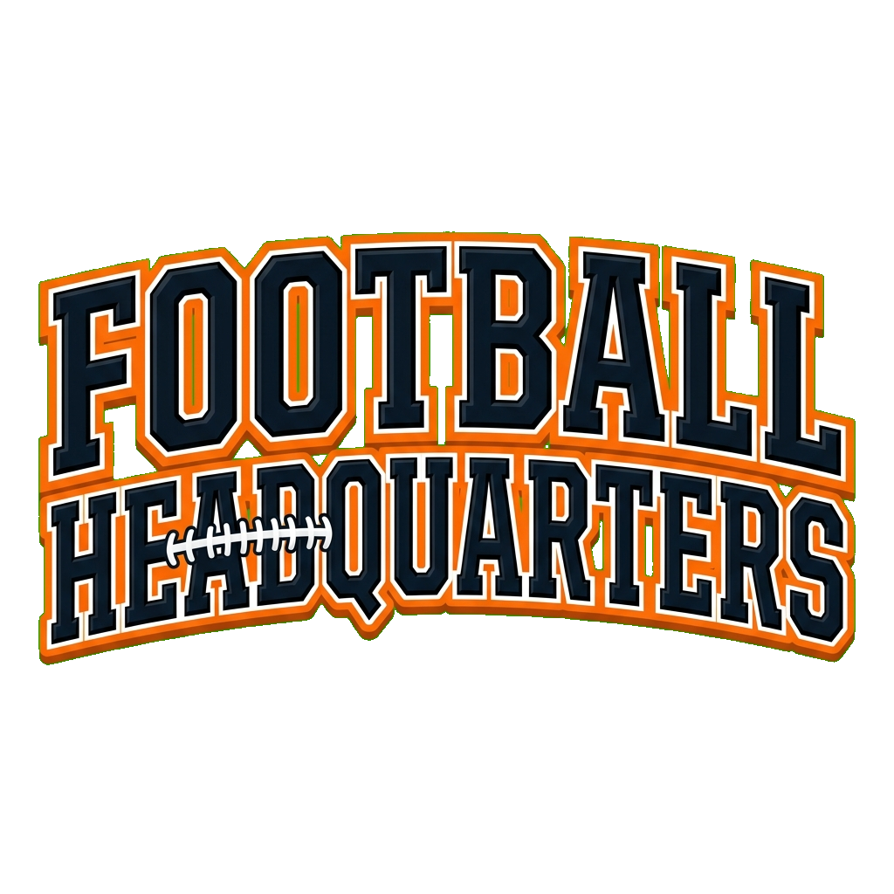
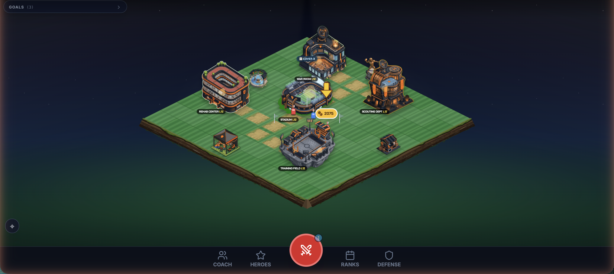

<p align="center"></p>

**▶️ Play it live: [football-headquarters.vercel.app](https://football-headquarters.vercel.app)** — every visitor becomes a Live Rival.

A **Clash-of-Clans / Castle-Clash-style base-builder**, reskinned to an American-football program.
Build your stadium, train position groups, unlock and level star heroes, then storm rival stadiums
in real-time raids to score touchdowns and climb the trophy ladder — all client-side, no backend.



> **Status:** work in progress. Playable end-to-end; some sprites are still being generated (they use
> emoji/placeholder fallbacks that auto-swap to real PNGs as they land).

---

## ✨ What's in it

- **Base building** — isometric field with upgradeable facilities (Stadium, Training Field, Scouting
  Dept, War Room, Rehab Center), timed upgrades gated by a limited pool of builders.
- **Roster & recruiting** — rarity-weighted scouting, position-group drills (energy-gated, timed),
  and **player tendencies** (Blitzer / Anchor / Playmaker / Iron Wall / …) that shape your offense
  and defense.
- **Hall of Heroes** — 9 heroes (incl. a premium unlock) that level **instantly with coins**, each
  with a signature impact: Hail Mary, Truck Stick, Field Medic, Shield Wall, Trick Play, Hall of Fame…
  **Scout Search** (gem gacha) finds new heroes — duplicates convert to **shards** that fuel
  ⭐ **star evolutions** (up to 5★, big multiplicative power spikes).
- **Season campaign** — a 12-game deterministic ladder from the Preseason Opener to THE
  CHAMPIONSHIP: 3-Game-Ball ratings per stage, first-clear gem + shard bounties, and late-season
  opponents that field extra coverage.
- **Real-time raids** — deploy individual players on a stadium field, run plays (Blitz / Trainer),
  send in your Mascot and Fan Mob, and **score a touchdown** on the enemy HQ. Non-violent, football-
  themed combat (footballs, penalty flags — no weapons).
- **Stadium defense** — your base *is* a stadium (crowd stands, tailgaters, walls). Rivals raid you
  offline; a **defense log**, **revenge**, and **post-raid shields** keep the async-PvP loop going.
- **Design mode** — a live **Defense Rating** (walls / structure / defenders / home-crowd) with a
  grade and "weakest link" callout — the optimize-your-base strategic hook.
- **Economy & ranking** — coins, gems (crowns), fans, energy; a **trophy/rank ladder**
  (Sandlot → … → G.O.A.T.) with fresh trophy-scaled matchmaking each raid.
- **Daily Practice** — three curated daily quests paying Crowns + a Daily Sweep bonus: the
  session-to-session drip that feeds Scout Searches.
- **Live Rivals (async PvP)** — publish your base and raid **real players'** stadiums; their
  attacks land in your Defense Log. Supabase-backed with zero SDK deps, and the game degrades
  gracefully to generated rivals until it's connected — see **`PVP-SETUP.md`** (5-minute setup).
- **Persistence** — everything autosaves to `localStorage`; offline progress (collectors + rival
  raids) is resolved on load.

## 🛠 Tech stack

- **React 19** + **Vite 6** + **TypeScript**
- **Tailwind CSS** (via CDN in `index.html`) · **lucide-react** icons
- **Web Audio API** synthesized SFX (no audio files)
- 100% client-side — state lives in `localStorage` (`fhq_save_v1`)

## 🚀 Getting started

```bash
npm install
npm run dev      # → http://localhost:3000
npm run build    # production build to /dist
npm run preview  # preview the build
```

## 📁 Project layout

```
App.tsx              # root state, game loop, handlers, load/save
battle.ts            # real-time combat model, heroes, matchmaking, headless sim
defense.ts           # Defense Rating (walls/structure/defenders/crowd)
ranks.ts             # trophy ladder + rank tiers
objectives.ts        # concurrent-goals engine
recruiting.ts        # scouting / candidate rolls
constants.ts         # config, tendencies, buildings, drills, roster
assets.ts            # sprite path resolvers
components/           # BattleScreen, IsometricMap, HeroModal, Design/Scouting/… modals
public/assets/        # building / unit / hero / battle / icon / decor sprites
```

## 🎨 Art pipeline

Sprites are generated to a locked house style. See:

- **`ART-DIRECTION.md`** — the style contract (palette, camera families, prompt templates).
- **`DESIGN-BIBLE.md`** — the creative vision (vocabulary, unit/hero/defense rosters).
- **`MISSING-ASSETS.md`** — the generation queue with per-asset prompts + save paths.

New art drops into `public/assets/…` and auto-swaps in via `onError` fallbacks — no code changes needed.
